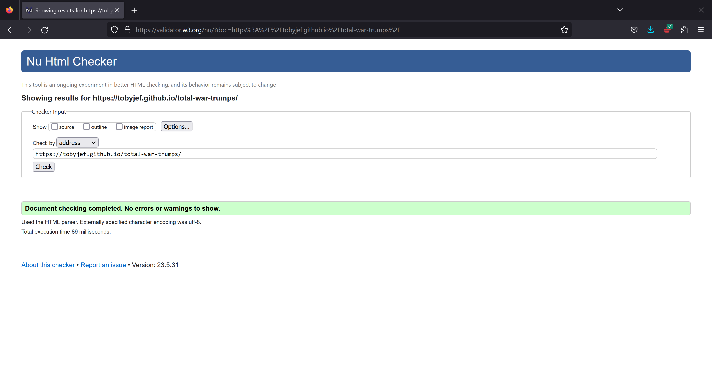
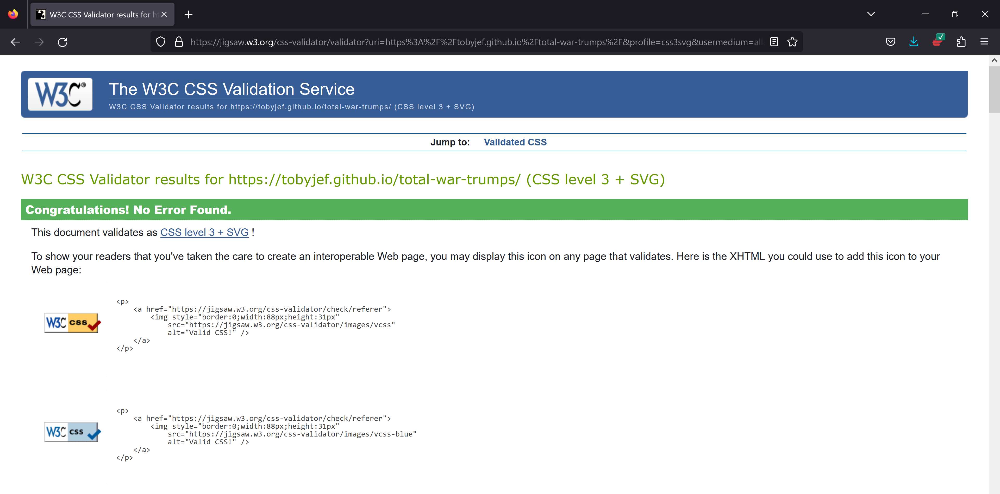
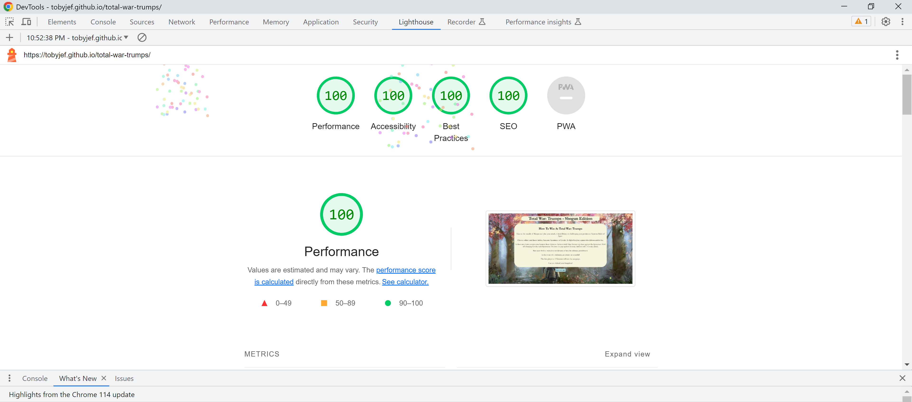
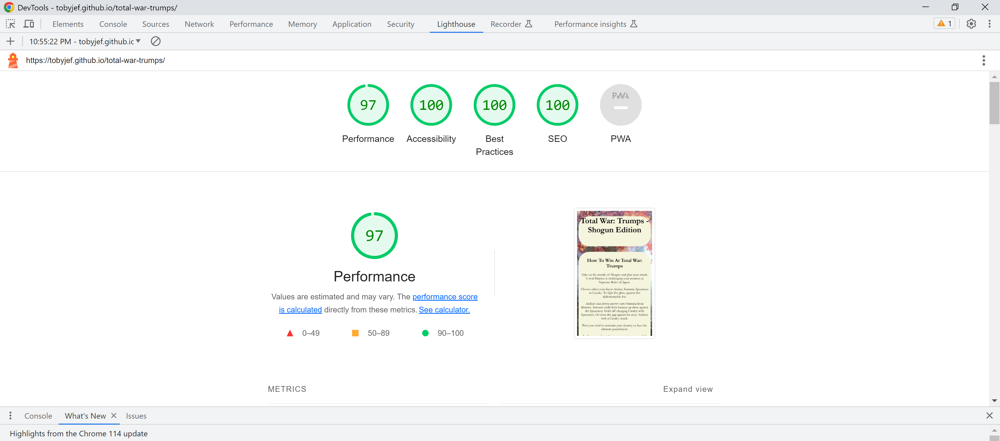
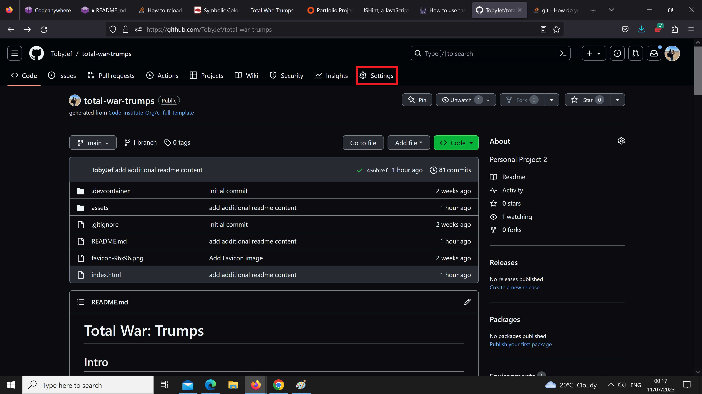
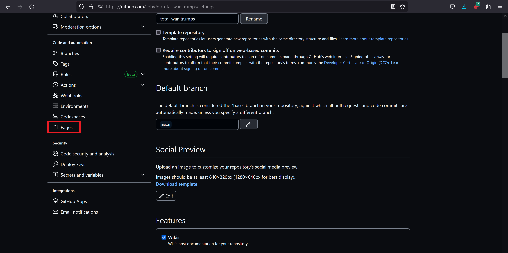
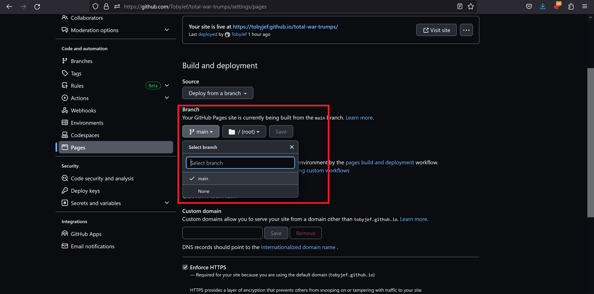
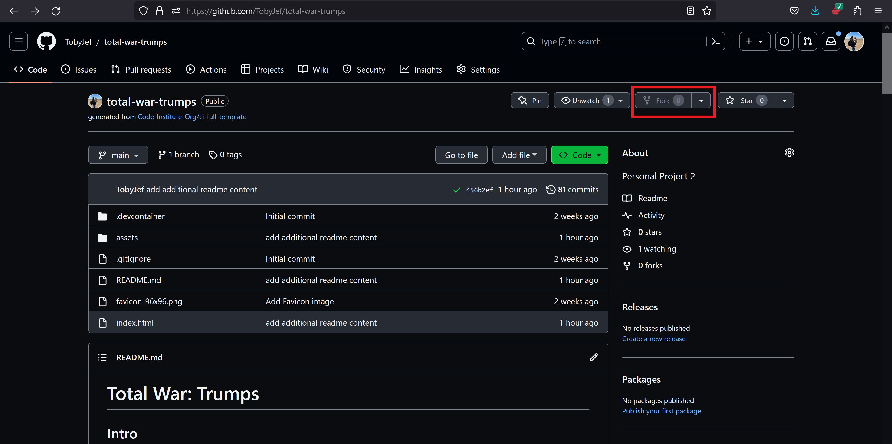
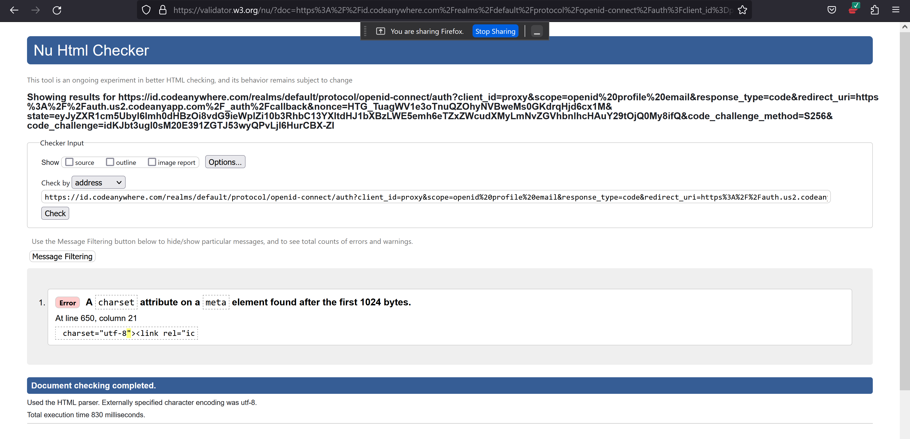
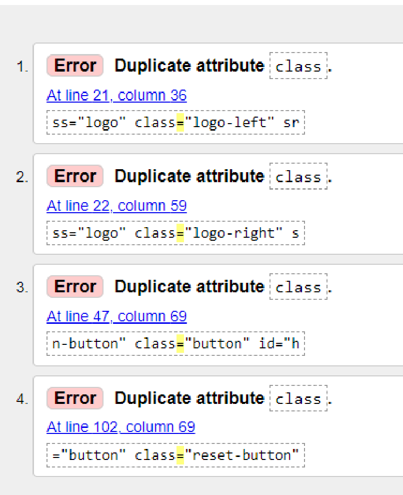

# Total War: Trumps

## Intro

Total War Trumps is a game based on the classic game of Rock, Paper, Scissors. But given a new twist by basing your choices on combat units from the hit real time strategy game, Total War: Shogun 2. Tally your score and prove you are the superior commander against the computer by picking one of four units and see who trumps who. The aim of the game is to become the first player to reach 5 Victories.

Similar in logic to Rock, Paper, Scissors where Rock beats Scissors, Scissors beats Paper and Paper beats Rock. Total War: Trumps, works on the same logic of comparing strengths and weaknesses.

In this game, the units consist of Archers, Samurai, Yari Spearmen and Cavalry.
Archers trump Samurai, Samurai trump Yari Spearmen, Yari Spearmen trump Cavalry and finally Cavalry trumps Archers.
While Archers against Spearmen and Samurai against Cavalry will result in a draw, which results in no points being awarded.

[Link to the live Total War: Trumps website](https://tobyjef.github.io/total-war-trumps/)

## Features

- On page load you are met with the games rules, objective and backstory. Below sits a button inviting them to begin the game. Upon clicking the button the backstory and rules overview content disappear to reveal the game with short reminder on how to win. Due to the differences between the standard and well known Rock, Paper, Scissors game that this game is based on.
  

- insert screenshot of rules-box with button and hidden game area content here..

- The game area consists of three blocks of content. The main game area, consists of;

- The reminder on how to win at Total War: Trumps at the top. Below shows the four game cards the player has to choose from.
- These options for those playing are an Archer card, a Samurai card, a Spearmen card and a Cavalry card. I have styled the game cards to scale upwards to 1.1 of the orignal image size to help identify which game card the user is hovering over.

- Below the main game are is a small text box with the purpose of displaying the Glorious Victory! message to the player if the win or the Shameful Defeat! message if the player has lost to the cpu opponent. Following either the win or loss message there is a short message that informs the player of each card that was played in that round.

- Finally there is the score tally box which shows the player and cpu score. The score correctly increments automatically at the end of each hand and awards a point to the respective winner. Once the desired score has been reached, a new message will appear informing wether the player had won or lost the full game. The win message to the player is shown in green, while the loss message is displayed in red. These colours were chosen as they can be associated with positive (green) or negative (red) actions.

- A seperate button is added (to be implemented) which is designed to reset the scores to 0-0 and allow the player to play again.

## Technologies Used

- HTML
- CSS
- JavaScript

Content

## Images

- Game unit images taken by screenshot, from my personal copy of Total War: Shogun 2
- [Favicon image](https://www.favicon-generator.org/)
- Crossed sword image found via Bing image search
- Logo image found and saved from Shutterstock
- Background image found
- [Link for image]()

## Page style decisions

- Following research into the traditional colours of ancient Japan, this has influenced my choice in using more muted and plain colours used within my styling.
- The beige colour used throught the page for the main content was used to not clash with my used background image, and to focus the player towards the backstory, rules and game area. While allowing the more colourful aspect of the playing cards to stand out.
- The white colour used for the score area and game outcome message was used to not only allow for clear visibility of the scores and the Victory or Defeat message depending on the outcome of the game. But to incluse some cultural referance also. The colour white was historically in Japan by the Emporer of Japan in Shinto Rituals. While also in Buddhism, the colour white also means death, and white attributes have been used for the ritual samurai suicide called ‘seppuku’. This was lightly eluded to in the backstory element of the game, as mentioned in the wording of the ultimate punishment, if the player lost. Important to note that neither myself or this game encourages or endorses the mentioned action. It is referred to as an educational and cultural norm that was reflected within that time period.

[Symbolic Colours in Japan](https://en.japantravel.com/blog/symbolic-colors-in-japan/61005).

## Who will play Total War: Trumps

- Total War: Trumps - Shogun Edition, and any planned future variations is intended for those that are fans of the real time strategy historical period combat games of the Total War series or for those seeking to play a historically themed and different variation of the game rock, paper, scissors. This game acts as an homage in way to Total War Shogun 2. Total War: Shogun 2 which is set in 16th century feudal Japan, allows players to take control of one of the nine in game factions to battle your way to power and control central Japan. Similar to the real life events that led to the unification of Japan.

## Future Improvements

- For a future update it would be my goal to add more units, adding further complexity to the game.
- I would also like to include a drop down option, allowing players to change the time period and the in game units.
  i.e. A Roman Empire update, Roman Urban Cohorts taking place of Sword Samurai, etc.
- Redesign and re apply the logo I had intended to use originally either side of the page title. During media queries and resizing it became to small to use on anthing smaller than a laptop screen.

## Testing

The validators used in the testing of the were:

- W3C HTML Validator
- W3C CSS Validator (Jigsaw)
- JSHint JavaScript Validator
- Google Developer Tools Lighthouse report

- HTML Validator - Validation passed with no errors found.
  

- CSS Validator - Validation passed with no errors found.
  

- JavaScript Validator - Validation passed.
  

- Lighthouse report score - Performance, Accessibility, Best Practices and SEO all rated at 100% when tested for Desktop. - Performance rated at 97%, Accessibility, Best Practices and SEO all rated at 100% when tested for Mobile.
  
  

## Deployment, Forking and Cloning

### Deployment

- The site Total War: Trumps - Shogun Edition was deployed to Github pages.

To deploy the live site on Github pages, the steps below are as follows:

- Login into Github.
- Go into the repository for this project, (https://github.com/TobyJef/total-war-trumps)
- Click the Settings button located on the upper navigation bar.
  
- Locate and select Pages from the Code and automation section of the left hand navigation menu.
  
  From the Branch dropdown box, select Main and press save.
  
- Following a short delay, the deployment will have been completed and the page provides a link to the completed website.
- The live link can be found below:
  [Link to the live Total War: Trumps website](https://tobyjef.github.io/total-war-trumps/)

### Forking and Cloning

- How to Fork the repository:

- Log into Github.
- Go to the repository for this project, (https://github.com/TobyJef/total-war-trumps)
- Click the Fork button found on the right of the page underneath the upper navigation bar.
  

- How to Clone the repository:

- Log into GitHub.
- Go to the repository for this project, (https://github.com/TobyJef/total-war-trumps)
- Click on the code button, select whether you would like to clone with HTTPS, SSH or GitHub CLI and copy the link shown.
  [Cloning](assets/images/documentation/repository-cloning.webp)
- Open a terminal in your code editor type 'git clone' into the terminal and then paste the link you copied from the Github repository. Press enter to change the current working directory to the location you want to use for the cloned directory.
  [Github Terminal](assets/images/documentation/github-clone.webp)

### Bugs

- Hide/Reveal content button issues.

- During initial HTML Validation an error returned on a Charset attribute on a Meta element. After reaching out to Sarah at Tutor Support, Sarah explained why that issue had occured. I was informed that the error occured because I submitted the working URL from the Github workspace and not the URL from the Live Site. Sarah also informed me that after she had checked the Live Site Url there was further errors discovered by the validator. These were down to elements having seperate multiple class names being assigned to them. Once those class elements were combined and the URL from the Live Site was resubmitted for validation. All checks returned clear.
  
  

### Acknowledgements and Credits

- I would like to acknowledge and credit the help I recieved from Ed at Tutor Support. I reached out to Tutor Support as I was struggling to
  figure out how to construct a function that checks to see when a score of 5 was reached, and that when the score was reached to display a message to the player they had either won or lost the game. On my first attempt I had actually written code that was close to the end result. However my code never called the message to display when a score of 5 was achieved. After removing that code and re writting the playerVictory function trying different methods with still no success. I reached out to Tutor Support. After speaking with Ed and explaining what I wanted my function to achieve. He showed an example of how that function should look. After looking at the example Ed had sent. The difference between the example function and what I had first written, was that in my first attempt, I had written: if (playerScoreCounter = 5). This changed the set player score that was set at 0, at the top of the js script (var playerScoreCounter = 0;), to 5 which was incorrect.

What should of been called was: if (playerScoreCounter === 5). Which checks the score once it reaches 5, and then call the rest of the function. I also initally had an initial issue with the function coming into action as where it was originally placed, as it was placed directly under the function playerVictory(). When discussing this issue with Ed, he advised that the newly re written function wasn't coming into being called as it placed incorrectly and that thought should be placed into where calling that function would serve it's purpose. Following a further discussion and a hint from Ed, I understood that the function should of been placed within the end of the game function. As that within this function, the player choice and computer choices was being checked to see which hand had won the round and assigning points. After the help and encouragement I recieved from Ed, I was able to understand how to carry that function forward with the additional calls, and allowed me to compose the cpuVictory function by myself.

- Credit to Sarah from Tutor Support that helped guide myself through the initial and then follow up error message that was flagged in the HTML Validation.

- Credit to my Mentor Graeme Taylor in his support and guidence over this project. Graeme helped to reduce the overall amount of JavaScript by combining three variable into one function. This allowed the construction of a three layered if and else if statement for count the scores and display a win/loss message.
