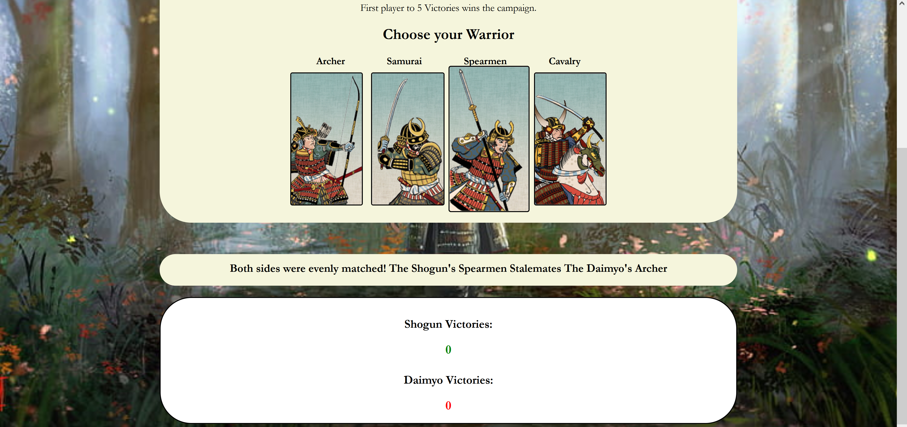
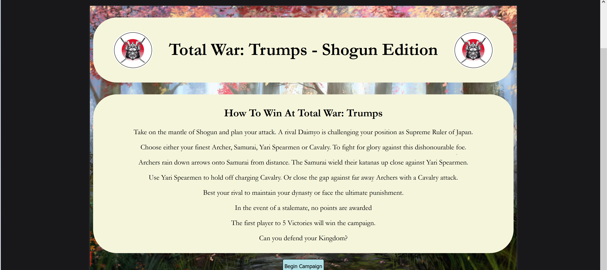

# Total War: Trumps - Shogun Edition

## Intro

Total War Trumps is a game based on the classic game of Rock, Paper, Scissors. But given a new twist by basing your choices on combat units from the hit real time strategy game, Total War: Shogun 2. Tally your score and prove you are the superior commander against the computer by picking one of four units and see who trumps who. The aim of the game is to become the first player to reach 5 Victories.

Similar in logic to Rock, Paper, Scissors where Rock beats Scissors, Scissors beats Paper and Paper beats Rock. Total War: Trumps, works on the same logic of comparing strengths and weaknesses.

In this game, the units consist of Archers, Samurai, Spearmen and Cavalry.
Archers trump Samurai, Samurai trump Spearmen, Spearmen trump Cavalry and finally Cavalry trumps Archers.
While Archers against Spearmen and also Samurai against Cavalry will result in a draw, which results in no points being awarded.
[Link to the live Total War: Trumps website](https://tobyjef.github.io/total-war-trumps/)

## Features

- On page load you are met with the games rules, objective and backstory. Below sits a button inviting them to begin the game. Upon clicking the button the backstory and rules overview content disappear to reveal the game with short reminder on how to win. Due to the differences between the standard and well known Rock, Paper, Scissors game that this game is based on.
  

- By clicking the Begin Campaign button, that triggers a click event within the JavaScript to reveal the previously hidden game area, whilst in turn hiding the previous text content featuring the games back story and rules.
  

- A reminder on how to win at Total War: Trumps shows at the top, above the four game cards the player has to choose from.
- The options for those playing consist of an Archer card, a Samurai card, a Spearmen card and a Cavalry card. I have styled the game cards to scale upwards to 1.1 of the orignal image size to help identify which game card the user is hovering over.
  

- Below the main game are is a text box with the purpose of displaying in the event of a player winning the round the
  Glorious Victory! message to the player or the Shameful Defeat! message if the player has lost to the cpu opponent, as well as message informing of a draw. This text box also tells the player of which card they have played and also of the cpu's choice.
  
  
  

- There is the score tally box which shows the player and cpu score. The score correctly increments automatically at the end of each round and awards a point to the respective winner. Once the desired score has been reached, a new message will appear informing wether the player had won or lost the full game. The win message to the player is shown in green, while the loss message is displayed in red. These colours were chosen as they can be associated with positive (green) or negative (red) outcomes.
  
  

- A play again button will then appear at the end of the game, which is designed to reset the scores to 0-0 and clears the previous games text content to allow the player to play again, from within the main game page. However due to a still unfixed bug, as a work around it is advised to refresh the page to play again. More detail is found within the bugs section of the README.

## Technologies Used

- HTML
- CSS
- JavaScript

Content

## Images

- Game unit images taken by screenshot, from my personal copy of Total War: Shogun 2.

- Crossed sword image found via Bing image search.
- [Favicon image](https://www.favicon-generator.org/)

- Logo image found and saved from Shutterstock.
- Logo image was further styled within CSS to round image into a circle.
- 

- Image found via Bing image search -[Link To in uses background image](https://wallpaper-mania.com/post/wallpaper-id-777000397879/)

- Did not use original choice of background image, due to poor pixalation on screens.

## Page style decisions

- Page layout was designed without out the use of tools such as Balsamic Wireframes. Page layout out was created from my own instinctive design of how I wanted the page to appear.
- Following research into the traditional colours of ancient Japan, this has influenced my choice in using more muted and plain colours used within my styling.
- The beige colour used throught the page for the main content was used to not clash with my used background image, and to focus the player towards the backstory, rules and game area. While allowing the more colourful aspect of the playing cards to stand out.
- The white colour used for the score area and game outcome message was used to not only allow for clear visibility of the scores and the Victory or Defeat message depending on the outcome of the game. But to incluse some cultural referance also. The colour white was historically in Japan by the Emporer of Japan in Shinto Rituals. While also in Buddhism, the colour white also means death, and white attributes have been used for the ritual samurai suicide called ‘seppuku’. This was lightly eluded to in the backstory element of the game, as mentioned in the wording of the ultimate punishment, if the player lost. Important to note that neither myself or this game encourages or endorses the mentioned action. It is referred to as an educational and cultural norm that was reflected within that time period.
  [Symbolic Colours in Japan](https://en.japantravel.com/blog/symbolic-colors-in-japan/61005).

- The used background image was found through a Bing image search. It's design was perfect for use for the Total War: Trumps - Shogun Edition as it depicts some of the units used in the game, from a similar time period, heading into battle.
  

## Who will play Total War: Trumps

- Total War: Trumps - Shogun Edition, and any planned future variations is intended for those that are fans of the real time strategy historical period combat games of the Total War series or for those seeking to play a historically themed and different variation of the game rock, paper, scissors. This game acts as an homage in way to Total War Shogun 2. Total War: Shogun 2 which is set in 16th century feudal Japan, allows players to take control of one of the nine in game factions to battle your way to power and control central Japan. Similar to the real life events that led to the unification of Japan.

## Future Improvements

- For a future update it would be my goal to add more units, i.e. Muskateers and re working the win/loss logic argument within the game. Hopefully to possibly reduce the amount of drawn rounds when using four cards and adding further complexity to the game.
- I would also like to include a drop down option, allowing players to change the time period and the in game units.
  i.e. A Roman Empire update, Roman Urban Cohorts taking place of Sword Samurai, etc.
  
- Redesign and re apply the logo I had intended to use originally either side of the page title. During media queries and resizing it became to small to use on anthing smaller than a laptop screen.
  
- To fix the replayGame function bug as mentioned within the features and bugs section.

## Testing

The validators used in the testing of the were:

- W3C HTML Validator
- W3C CSS Validator (Jigsaw)
- JSHint JavaScript Validator
- Google Developer Tools Lighthouse report

- HTML Validator - Validation passed with no errors found.
  

- CSS Validator - Validation passed with no errors found.
  

- JavaScript Validator - Validation passed with no errors or warnings found.
  

- Lighthouse report score - Performance, Accessibility, Best Practices and SEO all rated at 100% when tested for Desktop.
- Performance rated at 97%, Accessibility, Best Practices and SEO all rated at 100% when tested for Mobile.
  
  

## Deployment, Forking and Cloning

### Deployment

- The site Total War: Trumps - Shogun Edition was deployed to Github pages.

To deploy the live site on Github pages, the steps below are as follows:

- Login into Github.
- Go into the repository for this project, (https://github.com/TobyJef/total-war-trumps)
- Click the Settings button located on the upper navigation bar.
  
- Locate and select Pages from the Code and automation section of the left hand navigation menu.
  
  From the Branch dropdown box, select Main and press save.
  
- Following a short delay, the deployment will have been completed and the page provides a link to the completed website.
- The live link can be found below:
  [Link to the live Total War: Trumps website](https://tobyjef.github.io/total-war-trumps/)

### Forking and Cloning

- How to Fork the repository:

- Log into Github.
- Go to the repository for this project, (https://github.com/TobyJef/total-war-trumps)
- Click the Fork button found on the right of the page underneath the upper navigation bar.
  

- How to Clone the repository:

- Log into GitHub.
- Go to the repository for this project, (https://github.com/TobyJef/total-war-trumps)
- Click on the code button, select whether you would like to clone with HTTPS, SSH or GitHub CLI and copy the link shown.
  
- Open a terminal in your code editor type 'git clone' into the terminal and then paste the link you copied from the Github repository. Press enter to change the current working directory to the location you want to use for the cloned directory.
  

## Bugs

### Unresolved Bugs

- The main bug and one that is still to be resolved stems from JavaScript function named replayGame. Although the core purpose of the play again button and replayGame function succeeds in resetting the score and previous games outcome text. When the replayGame function is called into action which is linked to the click event of the play again button, a number of unusual and currently undiagnosed outcomes occur at the end of the first round that involve the final outcome message and the score counters functionality. If the next round played if the results in a player winning two back to back rounds the score will increase from one to 6. If the result is a draw, either the final Victory or Defeat message is displayed. I presume that the last bug is the result of the player loosing after the reset as the final Defeat message is displayed and the game cards become disabled.  
  
  
  

- An error shown in the conole section of the developer tools on the FireFox Browser when viewing the page via the workspace. Does not effect the sites performance in any way. Same error message is not shown when using the developer tools through multiple borswers on the live site.
- 

- An issue with the Favicon image not displaying on the live site tab. Resource to bug fix provided by Mentor during Project review. Unresolved due to time.
  [Link to the Favicon fix used](https://sneha-herle.medium.com/favicon-working-on-localhost-but-not-on-github-pages-6c7b9e947504)

### Resolved Bugs

- During initial HTML Validation an error returned on a Charset attribute on a Meta element. After reaching out to Sarah at Tutor Support, Sarah explained why that issue had occured. I was informed that the error occured because I submitted the working URL from the Github workspace and not the URL from the Live Site. Sarah also informed me that after she had checked the Live Site Url there was further errors discovered by the validator. These were down to elements having seperate multiple class names being assigned to them. Once those class elements were combined and the URL from the Live Site was resubmitted for validation. All checks returned clear.
  
  

### Media Screen sizes

- Desktop

- Tablet
  
  

- Mobile
  
  

### Acknowledgements and Credits

- I would like to acknowledge and credit the help I recieved from Ed at Tutor Support. I reached out to Tutor Support as I was struggling to figure out how to construct a function that checked to see, that when a score of 5 was reached, and to display a message to the player informing them, that they had either won or lost the overall game. After speaking with Ed and explaining what I wanted my function to achieve. He walked me through an example of how that function could look. I also initally had an issue with the function then being called, after further conversation I had incorrectly placed the call outside of the function. After the help and encouragement I recieved from Ed, I was able to better understand how to carry that function forward, and it allowed me to compose the following cpuVictory function by myself.

- Credit to Sarah from Tutor Support that helped guide myself through the initial and then follow up error message that was flagged in the HTML Validation. As previously mentioned within the bugs section.

- Credit to my Mentor Graeme Taylor in his support and guidence over this project. Graeme helped to reduce the overall amount of JavaScript by combining three variable into one function. This allowed the construction of a three layered if and else if statement for count the scores and display a win/loss message. Also for providing material with how to fix an issues with Favicon image not appearing in the live sites tab.
  [Link to the Favicon fix used](https://sneha-herle.medium.com/favicon-working-on-localhost-but-not-on-github-pages-6c7b9e947504)

### Final Commit

- The final commit before submission took place on the morning of 11/07/23.
